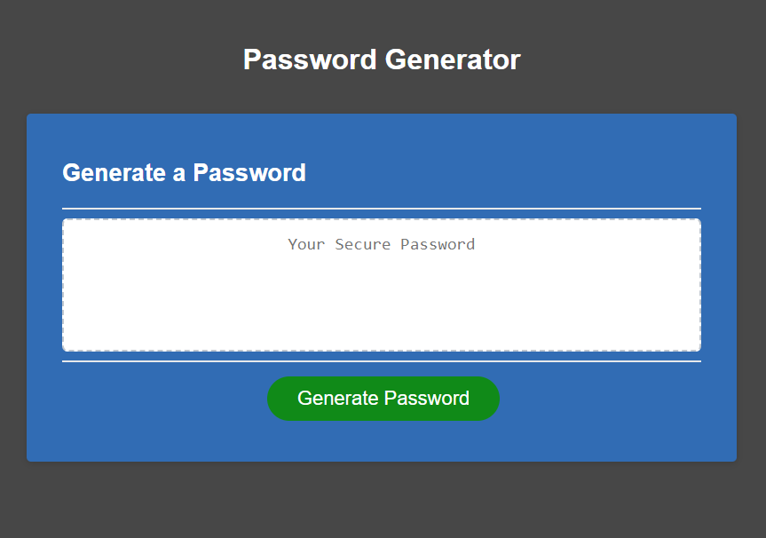

# Challenge-03 Password Generator

## Description

This page will serve as a password generator. A password may be customized by choosing various inputs such as: the length of the password, whether or not lower case, uppercase, numbers, or symbols will be used in it and then the generator will display a randomized password in the text box which can be utilitzed as needed.

## Table of Contents

- [Installation](#installation)
- [Usage](#usage)
- [Credits](#credits)
- [License](#license)

## Installation

This is a live page that can be viewed at https://jk377y.github.io/Challenge-03-password-generator/

## Usage

This page can be viewed at https://jk377y.github.io/Challenge-03-password-generator/

## Credits

Drew Devito https://www.linkedin.com/in/williamdrewdevito/ for collaboration and ideas during the creation of this project.

Fabien Moreno https://www.linkedin.com/in/fabien-moreno/ for collaboration and ideas during the creation of this project.

W3C https://validator.w3.org/ for use of the markup validation service.

Mozilla MDN Web Docs https://developer.mozilla.org/en-US/ for use of documenation for technical reference.

Mosh Hamedani https://www.youtube.com/c/programmingwithmosh for use of instructional videos and walkthroughs of several JavaScript topics.

Florin Pop https://www.youtube.com/channel/UCeU-1X402kT-JlLdAitxSMA for use of instructional videos and walkthroughs of several JavaScript topics.

FreeCodeCamp https://www.freecodecamp.org/ for use of instructional videos and walkthroughs of several JavaScript topics.

## License

MIT License

Copyright (c) 2022 James Kelly

Permission is hereby granted, free of charge, to any person obtaining a copy of this software and associated documentation files (the "Software"), to deal in the Software without restriction, including without limitation the rights to use, copy, modify, merge, publish, distribute, sublicense, and/or sell copies of the Software, and to permit persons to whom the Software is furnished to do so, subject to the following conditions:

The above copyright notice and this permission notice shall be included in all copies or substantial portions of the Software.

THE SOFTWARE IS PROVIDED "AS IS", WITHOUT WARRANTY OF ANY KIND, EXPRESS OR IMPLIED, INCLUDING BUT NOT LIMITED TO THE WARRANTIES OF MERCHANTABILITY, FITNESS FOR A PARTICULAR PURPOSE AND NONINFRINGEMENT. IN NO EVENT SHALL THE AUTHORS OR COPYRIGHT HOLDERS BE LIABLE FOR ANY CLAIM, DAMAGES OR OTHER LIABILITY, WHETHER IN AN ACTION OF CONTRACT, TORT OR OTHERWISE, ARISING FROM, OUT OF OR IN CONNECTION WITH THE SOFTWARE OR THE USE OR OTHER DEALINGS IN THE SOFTWARE.

